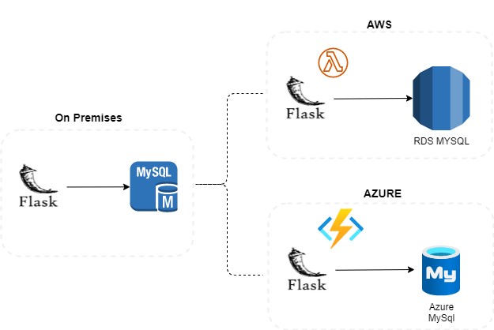

# Python Flask App Serverless Deployment 

## Use case:
1. Migrate and Refactor the Python flask api from On-Premise to Cloud
2.	Move the Flask binaries to Serverless app in cloud (AWS Lambda or Azure Function App)
3. Refactor the On-Premise MySql Database to PaaS (Aws RDS or Azure MySQL)

## Solution

    

